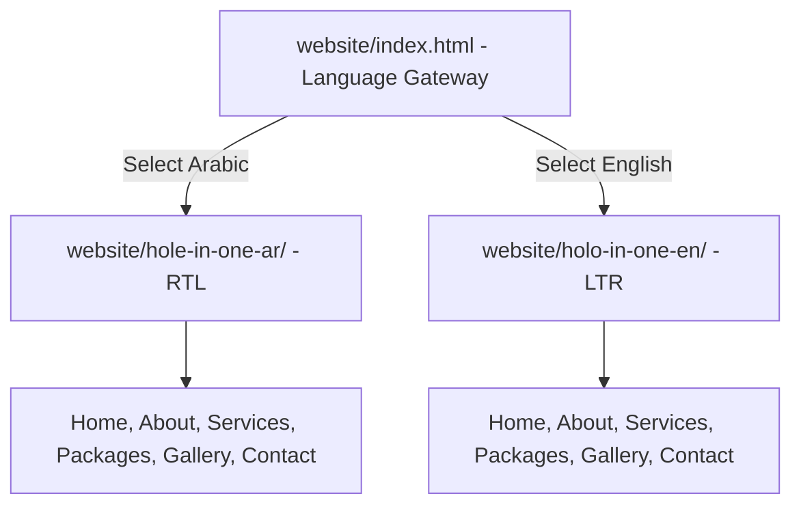

<div align="center">

# ⛳ Hole-in-One: Luxury Golf Resort & Spa Website

**Modern, Fully Responsive Bilingual Web Application Built with Semantic HTML5, CSS3 & JavaScript**

[](https://developer.mozilla.org/en-US/docs/Web/HTML)
[](https://developer.mozilla.org/en-US/docs/Web/CSS)
[](https://developer.mozilla.org/en-US/docs/Web/JavaScript)
[]()
[]()
[]()
[](LICENSE)

</div>

---

## 📌 Project Overview

**Hole-in-One Golf Resort & Spa** is a multi-page, bilingual hospitality web application engineered to deliver an immersive digital experience for a luxury golf retreat and hotel. Developed under **Pearson BTEC Higher National / Level 3 IT - Unit 06: Website Development**, the platform integrates modern web design paradigms, cross-browser compatibility, search engine optimization (SEO) basics, and fluid responsive layouts across mobile, tablet, and desktop viewports.

The application provides dual-language support with dedicated native LTR (English) and RTL (Arabic) directional styling, an interactive multimedia gallery, booking package inquiries, service catalogs, and validated contact forms.

---

## 🌐 Dual-Language & Architectural Structure

The website is architected with a top-level language gateway directing visitors to dedicated language directories:



### Core Pages Included (Both Languages):
1. **Home (`index.html`):** Hero showcase with call-to-action buttons, feature highlights, and video/imagery.
2. **About Us (`about.html`):** Resort history, championship course specifications, and leadership philosophy.
3. **Services (`services.html`):** Detailed breakdown of golf coaching, spa treatments, private dining, and clubhouse amenities.
4. **Packages (`packages.html`):** Interactive pricing cards, weekend getaway packages, and membership tiers.
5. **Gallery (`gallery.html`):** Categorized visual showcase of golf courses, luxury suites, gourmet cuisine, and tournaments.
6. **Contact (`contact.html`):** Integrated inquiry forms, interactive location coordinates, and operational hours.

---

## 🚀 Version Evolution (v1.0 ➔ v2.0)

| Feature / Area | Prototype Release (v1.0) | Production Release (v2.0) |
| :--- | :--- | :--- |
| **Visual Hierarchy** | Standard card layout and static imagery | **Modernized typography, elevated box-shadows, and micro-interactions** |
| **Responsive Navigation** | Basic dropdown menu | **Dynamic mobile drawer menu with smooth hamburger toggles** |
| **Bilingual Styling** | Basic text translation | **Native RTL typography, mirrored spacing, and custom Arabic fonts** |
| **Gallery Interactivity** | Static image grid | **Interactive filtering and lightbox-style zoom effects** |
| **CSS Optimization** | Redundant CSS rules | **Modular CSS variables, Flexbox alignments, and CSS Grid systems** |

---

## 🎯 BTEC Unit 06 Learning Aims & Deliverables

| BTEC Assessment Phase | Engineering Focus Area | Deliverables & Documentation |
| :--- | :--- | :--- |
| **Activity 1 (Aim A)** | **Web Architecture & Comparative Analysis** | Comprehensive comparative analysis of client-server models, DNS resolution, web hosting, HTTP/HTTPS security, and responsive design principles ([`docs/Web_Architecture_Comparative_Analysis_Aim_A.docx`](docs/)). |
| **Activity 2 (Aim B)** | **Website Planning & UI/UX Design** | Sitemaps, wireframes for mobile/desktop, color theory palettes, media asset registers, and user journey flowcharts ([`docs/Website_Planning_Wireframes_UIUX_Aim_B.docx`](docs/)). |
| **Task 3 (Aim C)** | **Front-End Development & Coding** | Semantic HTML5 structure, modular CSS3 stylesheets, and JavaScript interactivity documented in [`docs/HTML_CSS_Implementation_Testing_Task3.docx`](docs/). |
| **Task 4** | **Usability & Cross-Browser Testing** | W3C validation compliance, cross-browser rendering (Chrome, Edge, Firefox, Safari), and mobile viewport responsiveness in [`docs/Usability_and_CrossBrowser_Testing_Task4.docx`](docs/). |
| **Task 5** | **Review, Evaluation & Optimization** | User feedback analysis, performance benchmarking, and future enhancement roadmaps in [`docs/Website_Review_and_Evaluation_Task5.docx`](docs/). |

---

## 📂 Complete Project Structure

```text
Hole-in-One-Golf-Resort-Website/
├── website/                                   # Production Release (v2.0)
│   ├── index.html                             # Dual-Language Gateway & Portal Landing
│   ├── hole-in-one-ar/                        # Arabic RTL Version (Complete Multi-Page)
│   │   ├── index.html
│   │   ├── about.html
│   │   ├── services.html
│   │   ├── packages.html
│   │   ├── gallery.html
│   │   ├── contact.html
│   │   └── assets/                            # CSS (style.css), JS (main.js), Images
│   └── holo-in-one-en/                        # English LTR Version (Complete Multi-Page)
│       ├── index.html
│       ├── about.html
│       ├── services.html
│       ├── packages.html
│       ├── gallery.html
│       ├── contact.html
│       └── assets/                            # CSS (style.css), JS (main.js), Images
├── legacy/
│   └── v1.0/                                  # Initial Prototype Release (Historical Evolution)
├── docs/                                      # BTEC Unit 06 Comprehensive Documentation & Reports
│   ├── BTEC_Unit06_Website_Development_Brief.pdf
│   ├── Web_Architecture_Comparative_Analysis_Aim_A.docx
│   ├── Website_Planning_Wireframes_UIUX_Aim_B.docx
│   ├── HTML_CSS_Implementation_Testing_Task3.docx
│   ├── Usability_and_CrossBrowser_Testing_Task4.docx
│   └── Website_Review_and_Evaluation_Task5.docx
├── .gitignore                                 # Git exclusions
├── LICENSE                                    # MIT License
└── README.md                                  # Repository documentation
```

---

## 🚀 How to Preview and Run the Website

### Method 1: Direct Browser Launch
1. Navigate to [`website/index.html`](website/index.html) in your file explorer.
2. Double-click to open in any modern web browser (Google Chrome, Microsoft Edge, Mozilla Firefox, Safari).
3. Choose your preferred language (**العربية** or **English**) to explore the full site.

### Method 2: VS Code Live Server
1. Open the project folder in **VS Code**.
2. Right-click on `website/index.html` and select **Open with Live Server**.
3. Access the website at `http://127.0.0.1:5500/website/index.html`.

### Method 3: Deploy to GitHub Pages
1. Fork or clone this repository.
2. Navigate to **Settings** ➔ **Pages**.
3. Set the source branch to `main` and directory to `/ (root)` or configure a redirect to `/website`.

---

## 📄 License

This project is open-source and licensed under the [MIT License](LICENSE).

---

## 👨‍💻 Author

Developed by **Mamoun Sraiheen**  
*Passionate Full-Stack Web Developer, Software Engineer & Computer Science Student*
